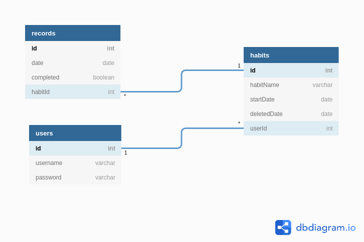

# Zeroto66-Server

**"습관이 만들어지는데 걸리는 시간 66일"**

습관은 사람을 만든다고 합니다. 그런데 66일 동안 유지하는게 쉽지 않은 일이죠.

그래서 습관으로 만들고 싶은 습관들을 성공했을 때 달력에 직접 보여줘서 얻을 수 있는 성취감을 통해서 습관을 만들어주는 웹 어플리케이션 Zeroto66를 만들었습니다.

- Notion : <a href="https://www.notion.so/wagucus198/Zeroto66-82bf623b597842a6bf4f9210794b7647">https://www.notion.so/wagucus198/Zeroto66-82bf623b597842a6bf4f9210794b7647</a>
- Client Github : <a href="https://github.com/Starcush/client-Zeroto66">https://github.com/Starcush/client-Zeroto66</a>
  <br><br>

## 설치 및 실행

### 설치

```js
$ npm install
```

### 실행

```js
$ npm run server
```

- "zeroto66"라는 database가 존재해야 합니다.

<br><br>

## 스택

<br>

- **Client** : Javscript(ES6), React, HTML/CSS<br><br>
- **Server** : Node.js, Sequelize, Mysql, JWT, Javscript(ES6)<br>
  <br><br>

## 데이터베이스

<br>
<br><br>
<br>

## API

Server에서 작성한 API는 Notion에서 확인이 가능합니다.
